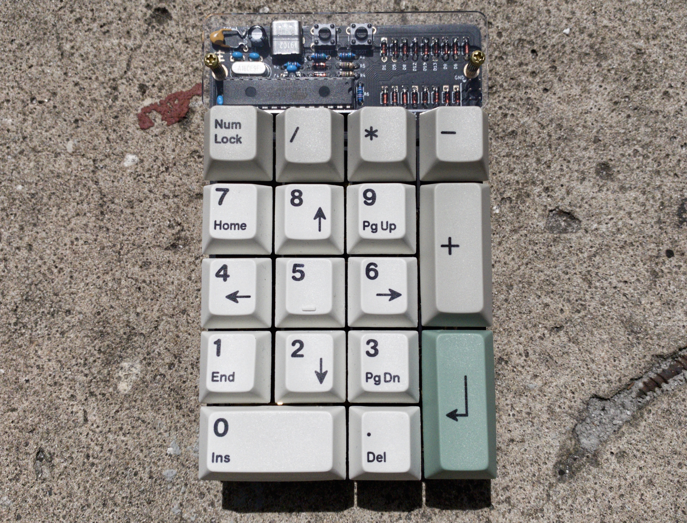
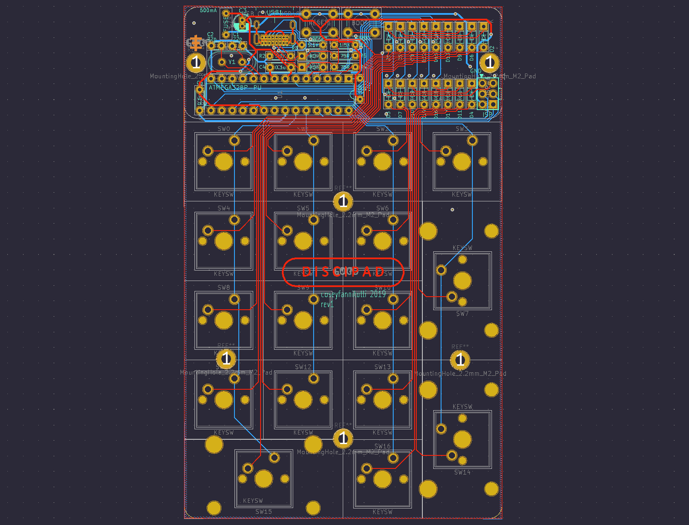
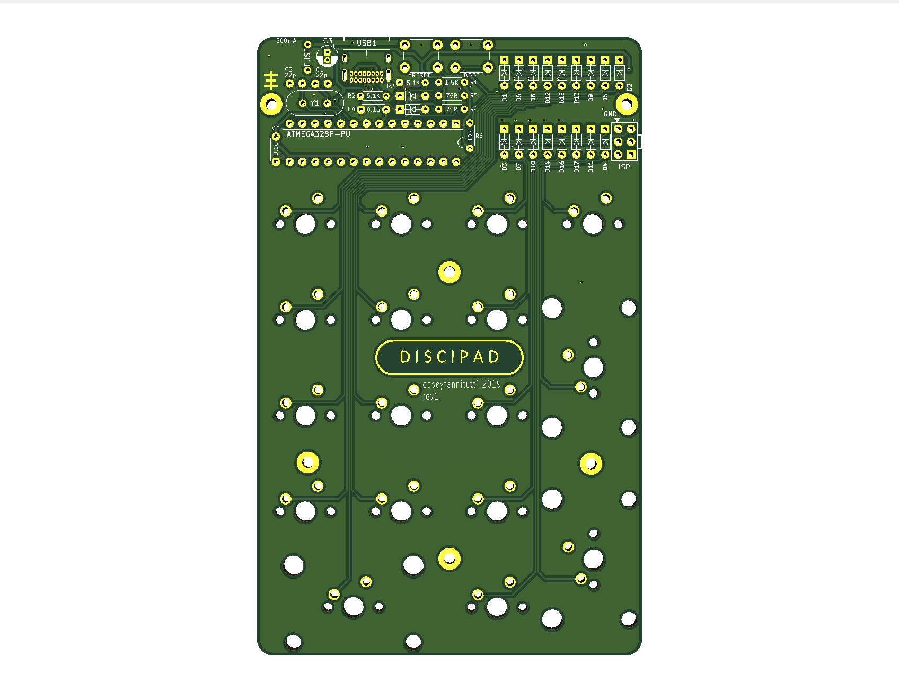
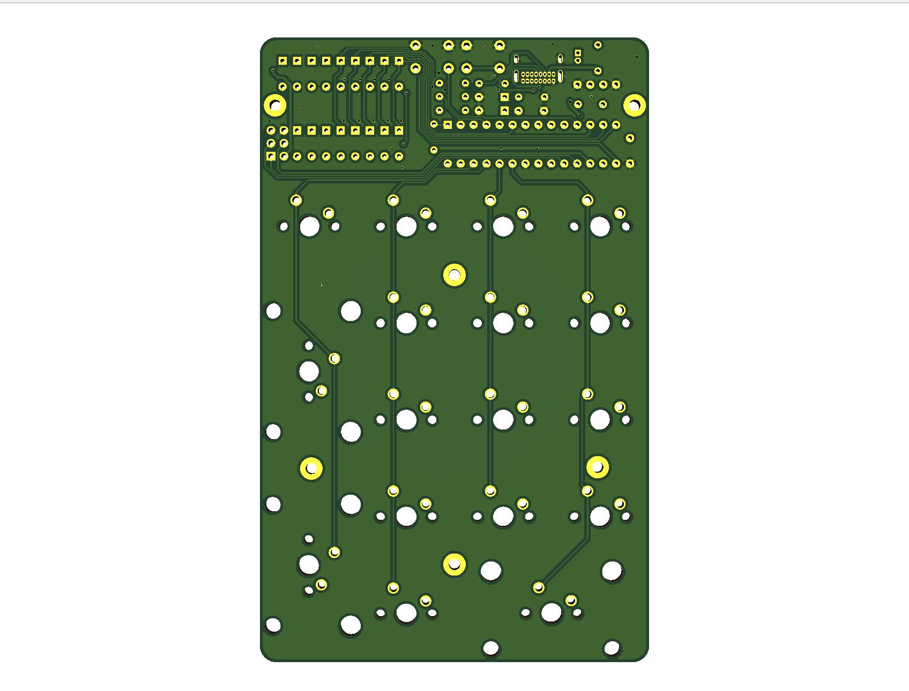

# discipad
 17-key numpad assembled with only through hole components, including usb type-c

[BOM, Build Guide, and Flashing Information](./doc)

Kits available at [cftkb.com](https://www.cftkb.com)

